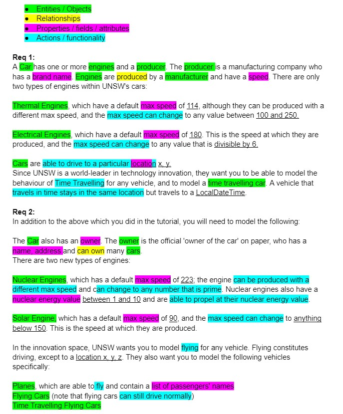
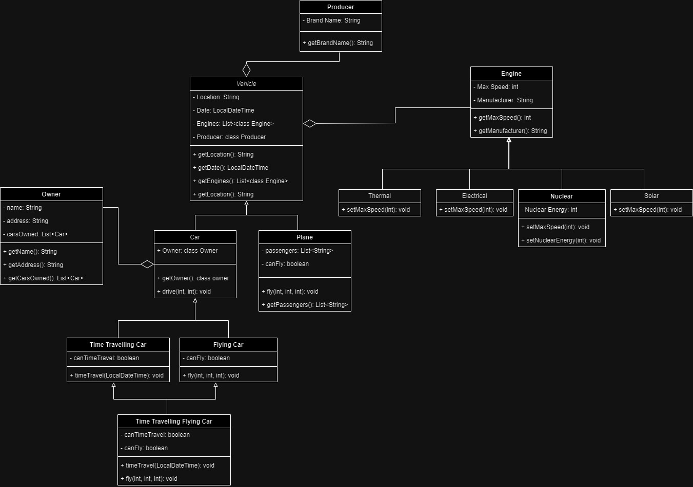

## Task 1

**New Requirements are:**
- All cars must have one or more engines, and an owner
    - Owner must have a name, address and list of cars owned
- Driving consists of travelling to a location with *x* and *y* coordinates
- Flying consists of travelling to a location with *x*, *y* and *z* coordinates
- Time Travelling only changes the Date of a car, not it's location
- Planes, while also needing an engine, require list of passengers' names
- All engines have a manufacturer
- Engines:
    - Thermal
        - Default Max Speed is 114
        - Max Speed is variable in between values of 100 and 250
    - Electrical
        - Default Max Speed is 180
        - Max Speed can only be changed to values divisible by 6
    - Nuclear
        - Default Max Speed is 223
        - Max Speed must be a prime number
        - Has a Nuclear Energy Value in between 1 and 10
    - Solar
        - Default Max Speed is 90
        - Max Speed has a maximum value of 150
    

## Task 2

The entities consisted of a Vehicle superclass which split into a Car and Plane class. The Owner class was assigned to the Car class since Cars were the only class in our diagram to contain an Owner. The Car sublcasses included; Time Travelling Car and Flying Car subclasses, as well as the Time Travelling Flying Car which extended both the Time Travelling and Flying Car subclasses. Other entities were the Engine and Producer classes. The Engine class had its respective engine subclasses with their own setters for the Max Speed since all of the different engines had different requirements for speed.

## Reflections
This task was tedious for it's short length, requiring a well thought out and logical UML diagram as well as re-defined requirements for the task at hand. Though it was not necessarily difficult, it was incredibly useful for understanding the design process of a program or a system. This task also helped in preparation for the assignment, teaching us how to properly organise and layout a design.
